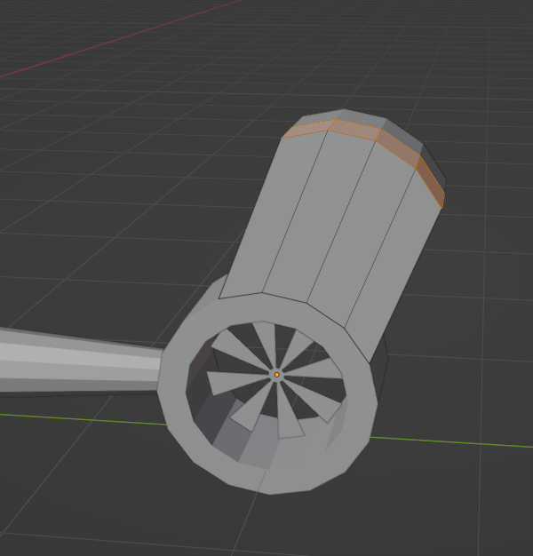
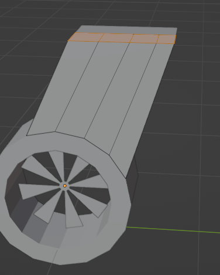
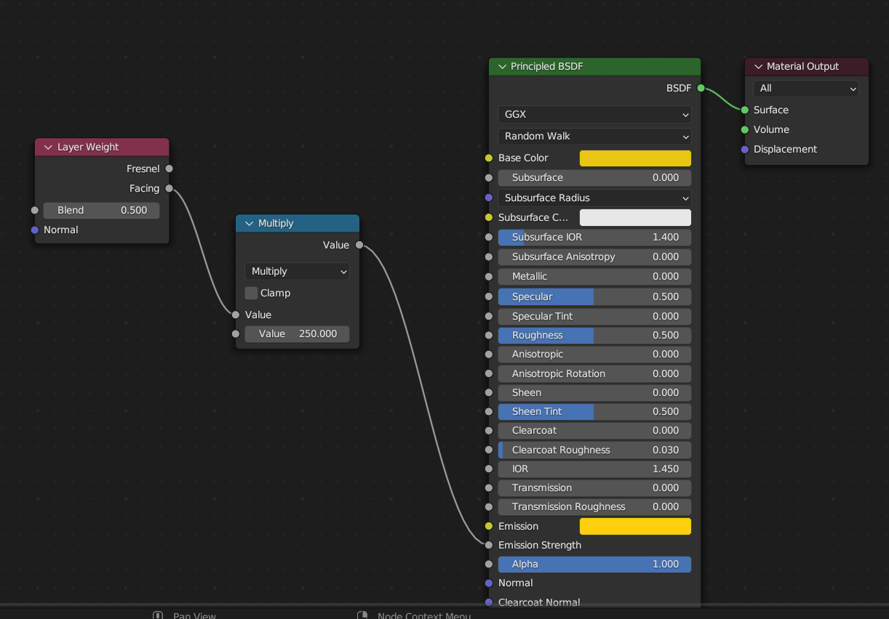
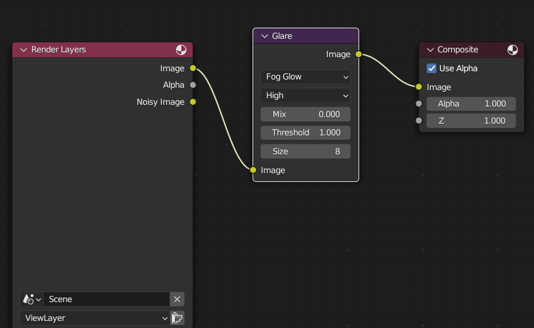

### Smooth some more
1. EM
2. `Mesh` -> `Transform` -> `To Sphere`

### Separate object
1. EM
2. Select the particular vertex
3. press `P` => `Selection`

### Set Origin
1. Select the object => go to edit mode
2. choose edge select, and select any one of the edge
3. `Shift s` => `Cursor to select`
4. come back to Object mode
5. right click => `Set Origin` => `Origin to 3d cursor`

### Show only particular object (Hide other object)
press back slash `/`

### Flip
scale (s) => (y) => -1

## Scale
1. Alt + s => change only the width, (height will remain the same)

### Move object to bottom
G + Z + 1

### Apply (scale , location and rotation)
ctrl + A

### Make cyclic
Shift + E

### Bavel
use to shape the border smooth (it will work only on EM)
1. go to EM
2. ctrl + B, use the mouse well to add multiple points
3. if the object is plane, then we have to use `ctrl + B + v`

### Select vertics
1. option-1: go to EM, press `C` key and select the place as you want
2. option-2: go to EM, select on vertics and `ctrl + +` it will select vertics one by one

### edge slider
if you want to move only the particular vertics, then we can go with this.
1. go to EM, select the edge, then press `G + G`

### Bool Tool (used in drone)
1. Enable add-on `bool tool`
2. select the object then press `ctrl + -(minus)`

## Camera
`ctrl + alt + 0` => to set the camera
`0` - to see the camera position
### Make blur background
1. OM => go to camera properties 
2. check `Depth of field` and open that one
3. Inside `Depth of field`
   1. `Focus on object` (select the object which one need to focus)
   2. `F-stop` use to adjust the blur

### What is recalculate normals

### Helicopter glass
if you have a two edges, but you need to extrude as same time, then you can use this way.
1. go to EM, select the edges
2. Alt + E => Extrude face along normals

### Bone
1. `Alt + P` clear parent
2. EM => `Ctrl + P` => Keep offset

### What is the difference between alt + d and shift + d

### Hide all the object show only selected object
1. select the object
2. press `/`

## 3 Key points
### Normals
1. go to EM, shift + N
2. to see the normals, go to the overlay drop down, check the `Face Orientation`

### To remove unwanted vertices
1. go to EM, select all the vertics
2. press M, choose by distance

### Convert Bezier to object
1. select the Bezier
2. make the share as we want
3. Properties adjust the value (img_001.PNG)
4. Bevel => Depth (adjust the value)

### Flat the surface.
1. go to EM, select the face as you want. (Ref: from img_003 to img_0044)
2. `S` + `Z` + `0`

Old             |  Conversion                    
:-------------------------:|:-------------------------:
  |   

### Glow effect
Material             |  Composting                    | Outpu
:-------------------------:|:-------------------------:|:-------------------------:
  |   |  

### Set World

### Bone
### Follow Look

### IK Constrain

#### Description
1. EM - edit mode
2. OM - object mode
3. PM - pose mode